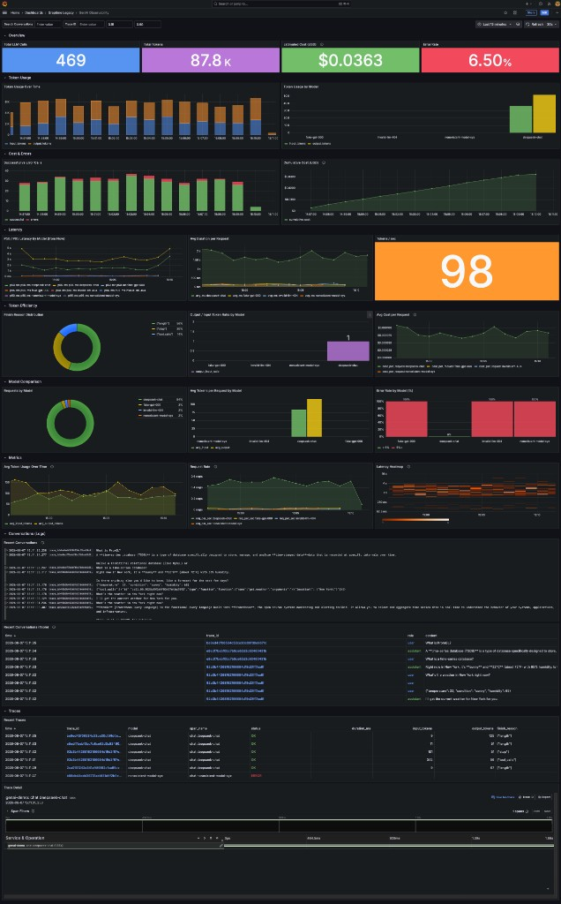
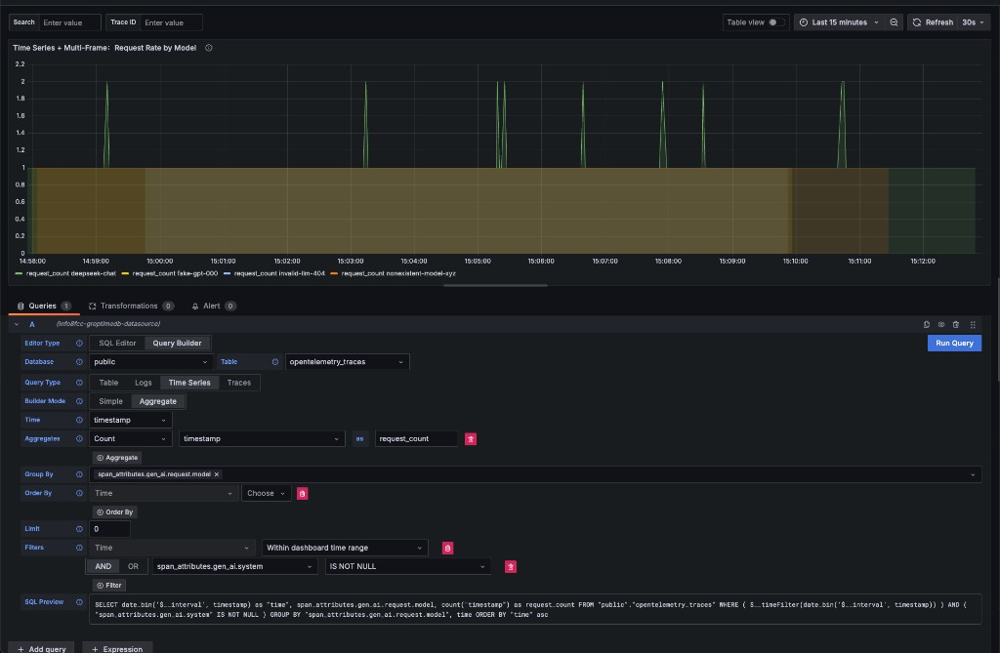

# GreptimeDB DataSource for Grafana


This is a [Grafana](https://grafana.com/grafana) data source plugin built for
[GreptimeDB](https://github.com/GreptimeTeam/greptimedb). This plugin is built
on top of the original Grafana ClickHouse data source and enhanced for
GreptimeDB's additional features.

## Installation

The recommended install path is the **unsigned** plugin zip from the [latest
release](https://github.com/GreptimeTeam/greptimedb-grafana-datasource/releases/latest/).
Allow unsigned loading for this plugin id first.

In `grafana.ini`:

```
allow_loading_unsigned_plugins = info8fcc-greptimedb-datasource
```

Or with Grafana in Docker:

```
GF_PLUGINS_ALLOW_LOADING_UNSIGNED_PLUGINS=info8fcc-greptimedb-datasource
```

### Manual install

Download `info8fcc-greptimedb-datasource-unsigned.zip` and unzip it into your
[Grafana plugins
directory](https://grafana.com/docs/grafana/latest/setup-grafana/configure-grafana/#plugins).

### Install with grafana cli

```
grafana cli --pluginUrl https://github.com/GreptimeTeam/greptimedb-grafana-datasource/releases/latest/download/info8fcc-greptimedb-datasource-unsigned.zip plugins install info8fcc
```

Restart Grafana after installing the plugin.

For a **signed** build (Private, bound to your Grafana `root_url`), please
[contact us](https://greptime.com/contactus).

### Docker Image

We also build Grafana docker image that includes GreptimeDB datasource by
default. To run the docker image:

```
docker pull greptime/grafana-greptimedb:latest
docker run -p 3000:3000 greptime/grafana-greptimedb:latest
```

You can log in Grafana by visiting http://localhost:3000. The default username and password are both set to admin.

## Included Dashboards

The plugin ships with two dashboards (same pattern as the ClickHouse
datasource). After you configure a GreptimeDB data source:

1. Open **Connections → Data sources →** your GreptimeDB instance
2. Open the **Dashboards** tab
3. Click **Import** next to a dashboard

Included dashboards:

- **GreptimeDB - OTel Min Demo**
- **GenAI Observability**



Sample data for these dashboards can be written into GreptimeDB via the
[genai-observability](https://github.com/GreptimeTeam/demo-scene/tree/main/genai-observability)
demo in [demo-scene](https://github.com/GreptimeTeam/demo-scene).


## Connection Settings

Click the Add data source button and select GreptimeDB as the type.


Fill in the following URL in the GreptimeDB server URL:

```txt
http://<host>:4000
```

In the Auth section, click basic auth, and fill in the username and password for GreptimeDB in the Basic Auth Details section (not set by default, no need to fill in).
- User: `<username>`
- Password: `<password>`

Then click the Save & Test button to test the connection.

## Configuring Column Mappings

Before using the Logs or Traces query types, configure the default column names
in the data source settings so the Query Builder can automatically map them.

### Logs Config

| Field | Purpose | Suggested (OTel table) |
|-------|---------|------------------------|
| Default Table | Default log table | `genai_conversations` |
| Time Column | Timestamp column | `timestamp` |
| Message Column | Log body column | `body` |
| Level Column | Log severity/level column | `severity_text` |
| Trace ID Column | Trace ID for linking | `trace_id` |
| Context Columns | Extra columns shown on log line expand | `scope_name`, `trace_id` |

Enable **Select context columns** to automatically include them in log queries.

### Traces Config

| Field | Purpose | Suggested (OTel table) |
|-------|---------|---------|
| Default Table | Default trace table | `opentelemetry_traces` |
| Trace ID Column | Trace ID | `trace_id` |
| Span ID Column | Span ID | `span_id` |
| Parent Span ID Column | Parent Span ID | `parent_span_id` |
| Service Name Column | Service name | `service_name` |
| Operation Name Column | Span/operation name | `span_name` |
| Duration Column | Duration value | `duration_nano` |
| Duration Unit | Unit of duration column | `nanoseconds` |
| Start Time Column | Span start time | `timestamp` |
| Tags Column | Span attributes prefix | `span_attributes` |
| Service Tags Column | Resource attributes prefix | `resource_attributes` |

### OTel Preset

If your table follows OpenTelemetry conventions, enable **Use OTel** and select
a version. All column fields above are filled automatically. You can toggle OTel
on/off in both the data source config and the Query Builder panel editor.

When OTel is enabled, the OTel preset uses GreptimeDB-style lowercase underscore
column names (e.g. `trace_id` not `TraceId`), since GreptimeDB does not preserve
case.

Full OTel 1.29.0 column map:

| Hint | Column |
|------|--------|
| Time | `timestamp` |
| LogLevel | `severity_text` |
| LogMessage | `body` |
| TraceId | `trace_id` |
| TraceSpanId | `span_id` |
| TraceParentSpanId | `parent_span_id` |
| TraceServiceName | `service_name` |
| TraceOperationName | `span_name` |
| TraceDurationTime | `duration_nano` |
| TraceTags | `span_attributes` |
| TraceServiceTags | `resource_attributes` |
| TraceStatusCode | `span_status_code` |
| TraceEventsPrefix | `span_events` |

## Query Builder

### General Settings

Before selecting any query type, you first need to configure the **Database**
and **Table** to query from.

| Setting | Description |
|:--------|:------------|
| **Database** | Select the database you want to query. |
| **Table** | Select the table you want to query from. |

Every Builder panel automatically includes a **Within Dashboard Time Range**
filter. This generates `$__timeFilter("col")` in the SQL, which the plugin
expands to the dashboard's current time range.

---

### Table Query

Choose the `Table` query type when your query results **do not include a time
column**. Suitable for displaying tabular data.

| Setting | Description |
|:--------|:------------|
| **Columns** | Select the columns you want to retrieve. Multiple selections allowed. |
| **Filters** | Set conditions to filter your data. |


---

### Metrics Query (Time Series)

Select the `Time Series` query type when your query includes a time column and
numerical values. Ideal for visualizing metrics over time.

**Three modes** control how data is aggregated:

| Mode | Builder Label | Behavior | Example |
|------|--------------|----------|---------|
| **Trend** | Aggregate | Bucket by `date_bin`, GROUP BY, aggregate | `SELECT date_bin('$__interval', ts) AS time, host, AVG(cpu) FROM t GROUP BY time, host` |
| **Aggregate** | Simple | GROUP BY, aggregate (no date_bin) | `SELECT ts AS time, host, AVG(cpu) FROM t GROUP BY ts, host` |
| **List** | List | Raw rows, no grouping or aggregation | `SELECT ts AS time, host, cpu FROM t ORDER BY time` |

| Setting | Description |
|:--------|:------------|
| **Time** | Select the time column. |
| **Columns** | Select label columns (e.g. `host`, `region`). |
| **Aggregate functions** | AVG / MAX / MIN / SUM / COUNT on value columns. |
| **Group By** | Select columns to group by. |
| **Filters** | Optional conditions: `=`, `!=`, `>`, `<`, `LIKE`, `IN`, `IS NULL`, AND/OR. |



#### Multi-Frame Splitting

When the query result contains **time + string + number** fields, the plugin
automatically splits the long table into multiple frames — one per unique label
combination. Grafana renders each frame as a separate series in the chart.

For example, `GROUP BY host` with three hosts produces three frames (host-a,
host-b, host-c), each with its own label and color.

To avoid splitting, use the `Table` query type instead.

---

### Logs Query

Choose the `Logs` query type for log data.

| Setting | Description |
|:--------|:------------|
| **Time** | Select the timestamp column. |
| **Message** | Select the column containing the log content. |
| **Log Level** | (Optional) Select the column for log severity. |
| **Context Columns** | Extra columns shown when you expand a log line (from data source config). |


**Full-text search**: use `matches_term(body, 'keyword')` for exact
term/phrase matching.

**View logs from traces**: clicking a `trace_id` cell shows a "View logs"
option. Requires a **Default Table** configured in the Logs Config section.

**Show context**: click a log line → Show context to see surrounding log
entries and configured context columns.

---

### Traces Query

Select the `Traces` query type for distributed tracing data.

**Two modes:**

| Mode | Purpose | Panel |
|------|---------|-------|
| **Trace Search** | List recent traces | Table |
| **Trace ID** | View a single trace's span waterfall | Traces (Gantt chart + span tree) |

To view a trace waterfall, either:
- Switch mode to **Trace ID** and enter a trace ID
- Click a `trace_id` cell in the Trace Search table → "View trace"

| Setting | Description | Default |
|:--------|:------------|---------|
| **Trace Mode** | `Trace Search` or `Trace ID` | |
| **Trace Id Column** | Trace ID field | `trace_id` |
| **Span Id Column** | Span ID field | `span_id` |
| **Parent Span ID Column** | Parent Span ID field | `parent_span_id` |
| **Service Name Column** | Service name field | `service_name` |
| **Operation Name Column** | Span/operation name field | `span_name` |
| **Start Time Column** | Span start time field | `timestamp` |
| **Duration Time Column** | Duration field | `duration_nano` |
| **Duration Unit** | Unit of duration column | `nanoseconds` |
| **Tags Column** | Span attributes (prefix like `span_attributes`) | |
| **Service Tags Column** | Resource attributes (prefix like `resource_attributes`) | |


#### Attribute Auto-Discovery

When the Trace ID query uses `SELECT *`, the plugin automatically discovers
all columns starting with `span_attributes.` and `resource_attributes.` and
includes them as expandable tags in the waterfall view. No need to manually
enumerate every attribute column.

## SQL Macros

Use these macros in raw SQL mode. The Go backend expands them to
GreptimeDB-compatible SQL.

### Time Range

| Macro | Expands To |
|-------|-----------|
| `$__timeFilter(col)` | `"col" >= 'ISO' AND "col" <= 'ISO'` |
| `$__timeFilter_ms(col)` | Same (ms precision) |
| `$__fromTime` | Start time as ISO string |
| `$__toTime` | End time as ISO string |
| `$fromTime_ms` | Start time as ms ISO string |
| `$toTime_ms` | End time as ms ISO string |

### Time Interval

| Macro | Expands To |
|-------|-----------|
| `$__timeInterval(col)` | `date_bin('<interval>', "col")` |
| `$__timeInterval_ms(col)` | `date_bin('<interval>', "col")` (ms) |
| `$__interval` | Panel interval literal (e.g. `15s`) |
| `$interval_s` | Panel interval in seconds (e.g. `15`) |

### Date Filters

| Macro | Expands To |
|-------|-----------|
| `$__dateFilter(col)` | `"col" >= 'YYYY-MM-DD' AND "col" <= 'YYYY-MM-DD'` |
| `$__dateTimeFilter(dc, tc)` | Date + time combined filter |
| `$__dt(dc, tc)` | Alias for `$__dateTimeFilter` |

### Special

| Macro | Expands To |
|-------|-----------|
| `$__conditionalAll(col)` | All selected → `1=1`; otherwise → `col IN (values)` |

### Identifier Quoting

The plugin automatically adds double quotes around column names in macros.
`$__timeFilter(timestamp)` and `$__timeFilter("timestamp")` both expand to
`"timestamp" >= 'ISO1' AND "timestamp" <= 'ISO2'`. The `date_bin` function
does NOT quote its column argument: `date_bin('15s', ts)`.

## Development

Yarn 1.x is required for this project. Execute these commands in code root folder

1. Install dependencies

   ```bash
   yarn install
   ```

2. Build plugin in development mode and run in watch mode

   ```bash
   yarn run dev
   ```

3. Build backend plugin binaries for Linux, Windows and Darwin:

   ```bash
   mage -v build:linux
   ```

4. Start Docker Service

   ```bash
   docker compose up
   ```

## License

GreptimeDB uses the [Apache License
2.0](https://apache.org/licenses/LICENSE-2.0.txt) to strike a balance between
open contributions and allowing you to use the software however you want.
